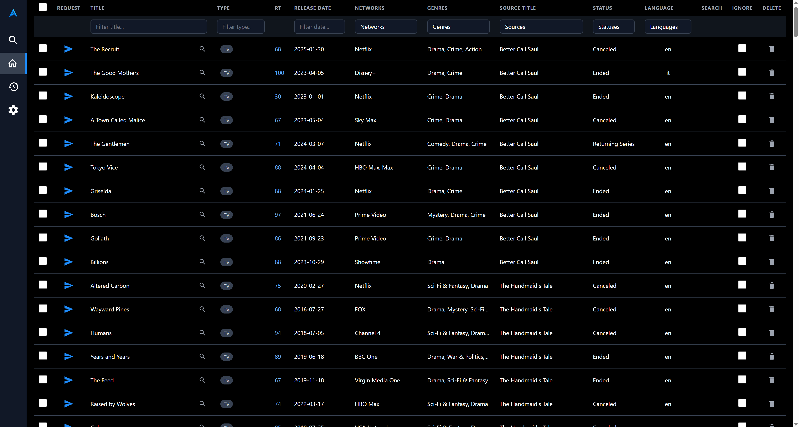
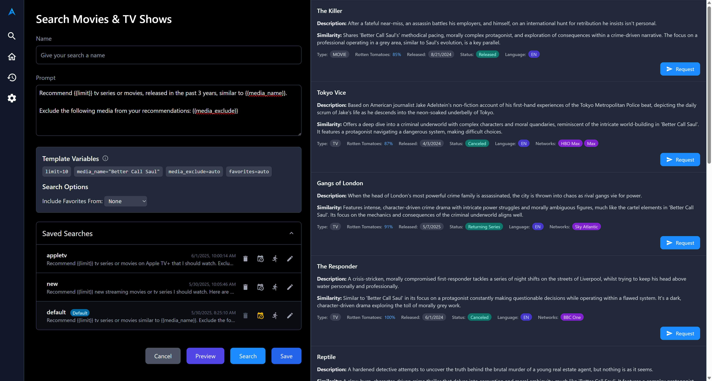
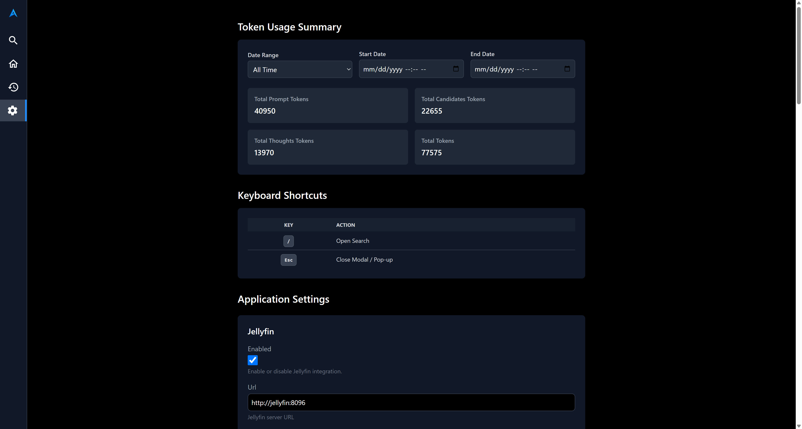

# AiArr - AI Powered Media Recommendations

## Description

AiArr is a comprehensive media management and automation tool designed to streamline your media consumption and discovery experience. It intelligently integrates with popular media servers like Jellyfin and Plex, download clients Radarr and Sonarr, and leverages the power of Google's Gemini AI to provide personalized media recommendations. 

With AiArr, you can:
- Automatically track your watch history from Jellyfin and Plex.
- Get intelligent media suggestions based on your viewing habits and preferences.
- Easily request new movies and TV shows through Radarr and Sonarr.
- Manage and customize search prompts for AI-driven recommendations.
- Schedule automated tasks for syncing history and processing suggestions.
- View and manage your media library, including active and ignored items.

### Screenshots

<a href=".assets/home_page.png" target="_blank" title="View Home Page Screenshot">
  
</a>
<a href=".assets/search_page.png" target="_blank" title="View Search Page Screenshot">
  
</a>
<a href=".assets/settings_page.png" target="_blank" title="View Settings Page Screenshot">
  
</a>

## Key Features

*   **Media Server Integration:**
    *   Seamlessly connect to **Jellyfin** and **Plex** to fetch user lists, watch history, and library content.
    *   Sync watch history across multiple users from both platforms.
*   **Downloader Integration:**
    *   Integrate with **Radarr** for movie requests and **Sonarr** for TV show requests.
    *   Manage quality profiles for downloads.
*   **AI-Powered Recommendations:**
    *   Utilize **Google Gemini AI** to generate personalized movie and TV show recommendations.
    *   Customize prompts and exclude existing media or ignored titles from suggestions. Prompts support templating with dynamic variables. 
    *   Leverage your "favorites" from Jellyfin/Plex to influence recommendations.
    *   Integrates with TMDB API to pull metadata for suggested title. 
*   **Automated Workflows:**
    *   Schedule job to automatically sync watch history.
    *   Schedule jobs to process watch history and generate new media suggestions.
    *   Manually trigger scheduled jobs as needed.
    *   Uses APScheduler and supports cron syntax. 
*   **Media Management:**
    *   View active and ignored media suggestions.
    *   Toggle the ignore status of media items.
    *   Delete media entries from the AiArr database.
*   **Search & Discovery:**
    *   Save and manage custom search prompts for AI recommendations.
    *   Run saved searches to get fresh suggestions.
    *   Preview rendered prompts before execution.
*   **User Interface:**
    *   A FastAPI-based backend provides a robust API for all functionalities. 
    *   A frontend UI to interact with the system. Based on Vite + Vue.js + Tailwind CSS.
*   **Configuration & Settings:**
    *   Manage all service integrations and application settings through a persistent database configuration.
    *   Settings can be overridden by environment variables.
*   **Database & Backup:**
    *   Uses SQLite for data persistence via the Peewee ORM. 
    *   Automatic database backups before schema migrations/upgrades.
*   **Monitoring & Stats:**
    *   Track Gemini API token usage for searches.
    *   View watch history grouped by user and date range.

## Prerequisites

- Jellyfin URL and API key
    - Can use docker container name in the URL if hosted on the same docker network
- Radarr URL and API key
    - Can use docker container name in the URL if hosted on the same docker network
- Sonarr URL and API key
    - Can use docker container name in the URL if hosted on the same docker network
- Gemini API key
- TMDB API key

## Background

The original intent was to write a script to generate a prompt that gave me recommendations that were not in my media library. After I got that working I decided to turn this into a full application. Code is 75% AI generated with lots of tweaking and polish to make it work well. Overall I'm happy with the result and find it very useful for media discovery and recommendations. Hope you find it useful as well!

## Scheduled Tasks
- The `sync_watch_histry` job that runs at midnight every night to sync the watch history for each user to the `watchhistory` table. This job can be triggered manually on the Watch History tab. It uses the `app.recent_limit` setting to control how many items for each user to sync. 
- The `recently_watched` default search queries the `watchistory` table, returing a set number of items based on the `app.recent_limit` setting. It then submits a prompt to the Gemini API using the prompt associated with the search. The `{{limit}}` prompt template variable is set using the `gemini.limit` setting. Results are saved to the `media` table and displayed on the Home tab. The default search is not scheduled initially. 

## Search
- Custom searches can be created and run ad-hoc, results are displayed and can be automatically saved with the `app.auto_media_save` setting. Saved searches are saved to the `media` table automatically. 
- Searches support various template variables like `{{media_name}}` `{{limit}}` `{{media_exclude}}` `{{favorites}}` that will be auto-populated at runtime. `{{media_name}}` is used to populate the Source column linking recommendations to the source title. Use the Preview button to preview the generated prompt before submitting. 
- The Search button next to items in Watch History or Home will navigate to the Search page and auto-populate the `{{media_name}}` variable accordingly.

## TODO
- Integration with other AI providers like OpenAI, Claude, etc. 
    - Gemini was choosen due to their generous free tier. 
- Unit tests. 
    - Once I lock in the feature set I'll write tests for all the critical paths
- Improve Plex integration. 
    - I use Jellyfin so that gets first class support. The Plex API is rather jank so there may be issues. 
- Overseer and Jellyseer integration. 
    - I don't use these but would be willing to consider supporting them. 

## Docker Compose Example

This example `docker-compose.yml` demonstrates a basic setup for AiArr. You'll need to adjust volumes and environment variables according to your specific setup. Environment variables can be configured here or left blank and set in the UI. 

### Basic
```yaml
services:
  aiarr:
    image: ghcr.io/tsquillario/aiarr:latest 
    container_name: aiarr
    restart: unless-stopped
    ports:
      - "8000:8000" 
    volumes:
      - ./aiarr_config:/config
      - ./aiarr_backups:/backups 
    environment:
      # Client needs to know where the API is. This will be your host machine IP or hostname since the client is connecting from your browser
      - VITE_AIARR_URL=http://192.168.0.100:8000/api
```

### Advanced
```yaml
# networks:
#   your_custom_network:
#     driver: bridge
#     external: true

services:
  aiarr:
    image: ghcr.io/tsquillario/aiarr:latest # Replace with your actual image name and tag
    container_name: aiarr
    restart: unless-stopped
    ports:
      - "8000:8000" # Exposes the FastAPI backend (adjust if your app runs on a different port)
    volumes:
      - ./aiarr_config:/config   # For aiarr.db and other configuration files
      - ./aiarr_backups:/backups # For database backups
    environment:
      # --- Application Settings ---
      - LOGLEVEL=INFO # DEBUG, INFO, WARNING, ERROR, CRITICAL
      # - APP_DEFAULT_PROMPT="Your custom default prompt here"
      # - APP_RECENT_LIMIT=10
      # - APP_TEST_MODE=False
      # - APP_BACKUP_BEFORE_UPGRADE=True
      # - APP_AUTO_MEDIA_SAVE=True
      # - APP_SYSTEM_PROMPT="Your custom system prompt for Gemini"

      # Client needs to know where the API is. This will be your host machine IP or hostname since the client is connecting from your browser
      - VITE_AIARR_URL=http://192.168.0.100:8000/api

      # --- Jellyfin Settings (Optional) ---
      - JELLYFIN_ENABLED=True # Set to True if using Jellyfin
      - JELLYFIN_URL=http://jellyfin:8096
      - JELLYFIN_API_KEY=your_jellyfin_api_key

      # --- Plex Settings (Optional) ---
      # - PLEX_ENABLED=True # Set to True if using Plex
      # - PLEX_URL=http://plex:32400
      # - PLEX_API_TOKEN=your_plex_token

      # --- Radarr Settings ---
      - RADARR_URL=http://radarr:7878
      - RADARR_API_KEY=your_radarr_api_key
      # - RADARR_DEFAULT_QUALITY_PROFILE_ID=1 # Example ID

      # --- Sonarr Settings ---
      - SONARR_URL=http://sonarr:8989
      - SONARR_API_KEY=your_sonarr_api_key
      # - SONARR_DEFAULT_QUALITY_PROFILE_ID=1 # Example ID

      # --- Gemini AI Settings ---
      - GEMINI_API_KEY=your_gemini_api_key
      # - GEMINI_MODEL=gemini-pro # Or your preferred Gemini model
      # - GEMINI_LIMIT=5
      # - GEMINI_THINKING_BUDGET=1024
      # - GEMINI_TEMPERATURE=0.7

      # --- TMDB Settings ---
      - TMDB_API_KEY=your_tmdb_api_key
    # networks:
    #   - your_custom_network # Optional: if you use custom Docker networks
```